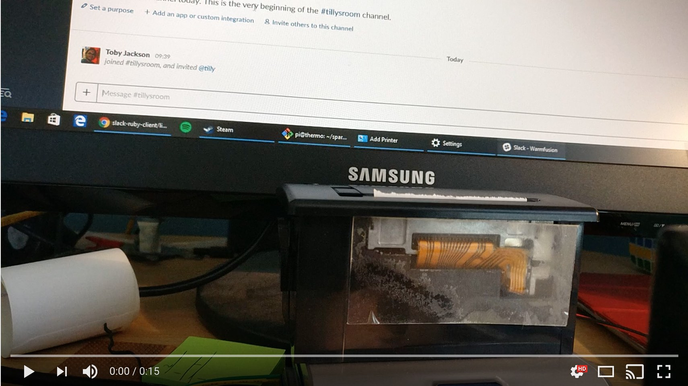

[This](docs/Tilly-v1.0-Demo.jpg) is Tilly... a printer bot that'll print
messages from slack onto till roll thermal paper for posterity/evidence
for your team.

* [Project Log](https://hackaday.io/project/21191-tilly-the-slack-printer)

# Usage

1. Follow the Setup instructions below to get API tokens and the service running
1. Add `@tilly` (or whatever you named your integration) to the room
1. 'React' to a message with the `:printer:` emoji and the printer will do its thing

## Known Issues

- Adding `@tilly` to a private channel seems to change the internal id so older messages
    can't be found as the channel ID doesn't exist..?
- @mentions are showing internal ID values rather than friendly names

## TODO

- [x] Print message based on emoji event
- [ ] Have some basic interaction to help people find out more about Tilly
- [x] Write better documentation about the build
    - [Tilly - The Slack Printer](https://hackaday.io/project/21191-tilly-the-slack-printer)
- [ ] Support command line configuration for printer endpoint/token
- [ ] Include real usernames when message includes @mentions
    - Currently includes <@U4X4xxxx> strings which isn't so nice
- [ ] Print avatar/emoji characters inline in message
- [ ] Show images for
    - [x] Giphy embeds - First frame, sometimes breaks
    - [ ] Uploaded images/photos - Files dont get associated with channels for some reason
    - [x] Unfurled links - Youtube/websites etc
- [ ] Better installation solution using bundler or similar

# Building The Hardware

Find out more on my Hackaday.io project page - (Tilly - The Slack Printer)[https://hackaday.io/project/21191-tilly-the-slack-printer]

Heres a working prototype before she got her lovely case.

## Parts List

1. Raspberry Pi
2. [Thermal Printer](https://www.sparkfun.com/products/10438)
    - Mine is TTY only, but USB _should_ work if you change `PRINTER_TTY`
3. Power cables 5v/2A for the printer as well as USB / ethernet etc
4. Googly Eyes - Optional

## Building

1. Pop the TTY connection onto pins 6,8,10 (GND,GPIO14, GPIO15)
2. Thats about it...

# The Software

## Prepare

1. [Create a new Custom Bot](https://my.slack.com/services/new/bot) integration
    - Can't use a 'App Bot' account as the `channels.history` API
    [is not accessible](https://api.slack.com/bot-users#api_usage)
    and as tilly can be added to any room and interact with messages in the past this
    is a required permission.
1. Connect up printer and power everything up

## Install

    git clone https://github.com/warmfusion/Tilly-The-Printerbot.git tilly
    cd tilly
    ./install.sh

If you are using jessie, or a systemd managed operating system, a systemd unit
file has been included for your convenience.

Simply follow the instructions below to ensure that your Tilly Printer Bot will
start automatically when your RPi is booted up for hands free operation.

    cp printerbot.service /etc/systemd/system/
    systemctl daemon-reload              # Tell systemd that theres a new service in town
    systemctl enable printerbot.service  # Ensure it starts on boot
    systemctl start printerbot           # Start it up for now

    # Check service output with
    journalctl -u printerbot

## Execute

1. `echo "SLACK_AUTH_TOKEN=YOURTOKEN" > /etc/default/tillyprinterbot`
1. `systemctl restart printerbot`  # Or SLACK_AUTH_TOKEN=xxxx ruby printerBot.rb
1. Add `@tilly` (or whatever you named your integration) to rooms
1. React to a message with the `:printer:` emoji and the printer will do its thing
